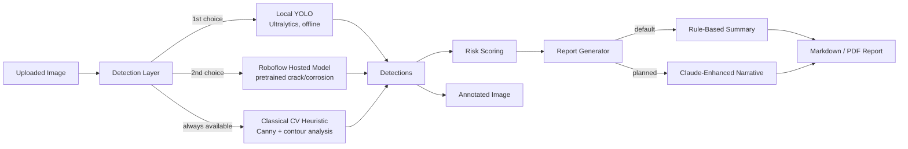

# VisionInspect AI

Automated first-pass visual inspection for industrial infrastructure — pipelines, sewer systems, tunnels, bridges, and manufacturing equipment — using computer vision to flag defects before a human engineer ever opens the image.

  

**Live demo:** [https://shahwar98-visioninspect-ai-app-fpkufd.streamlit.app/](https://shahwar98-visioninspect-ai-app-fpkufd.streamlit.app/)

## Overview

Infrastructure inspections generate thousands of images and video frames that engineers must manually review, one at a time, looking for cracks, corrosion, leaks, and other damage. VisionInspect AI automates the *first pass* of that process: upload an inspection image, and the system detects candidate defects, scores overall risk, and produces a downloadable inspection report — the same kind of triage step used by companies building autonomous inspection robots for water pipelines and similar critical infrastructure.

This is an **inference application**, not a model training project. The goal is to demonstrate the ability to design and ship a real, working computer vision system end-to-end under a tight timeline, using pretrained models rather than collecting and labeling a custom dataset.

## Motivation

I built this as a portfolio project to demonstrate practical computer vision and AI engineering skills relevant to industrial inspection and robotics companies: taking a real-world operational problem (manual image review at scale), wiring together pretrained AI models, and shipping a polished, usable interface around them — while being explicit about the tradeoffs of a fast build.

## Architecture

The system is deliberately split into independent layers so that any one piece — the detection model, the report generator, the UI — can be swapped without touching the others.



**Detection strategy chain** (`detector.py`): the app tries a local YOLO checkpoint first (if configured), then a hosted Roboflow pretrained crack-detection model, and always has a dependency-free classical computer-vision heuristic (edge detection + contour filtering) as a final fallback. This means the app **never crashes due to a missing API key** — it just degrades to a simpler strategy and tells you which one ran.

**Risk scoring** (`utils.py`): a transparent, explainable rule combining defect count and detection confidence into a Low / Medium / High rating — no black box, easy to defend in an interview.

**Report generation** (`report.py`): a deterministic rule-based generator by default; an optional toggle sends the same structured data to Claude (Anthropic API) to produce a more natural, engineer-facing narrative. If the API key is missing or the call fails, it silently falls back to the rule-based summary.

## Features

- Upload a JPG/PNG inspection image
- Automatic defect detection with a graceful multi-strategy fallback chain
- Annotated image with bounding boxes and confidence scores
- Defect count table
- Explainable Low / Medium / High risk scoring
- Rule-based inspection summary, with an optional Claude-powered narrative
- Downloadable report in Markdown and PDF
- Graceful fallback with a plain-language notice if the primary detector is unavailable

## Installation

```bash
git clone <this-repo-url>
cd visioninspect-ai
pip install -r requirements.txt
cp .env.example .env
```

The app runs with **no API keys configured at all** — it will automatically use the classical CV detector and rule-based reports. Add keys to `.env` to unlock the stronger detectors:

```bash
# .env
ROBOFLOW_API_KEY=your_key_here      # optional - hosted pretrained crack detector
ANTHROPIC_API_KEY=your_key_here     # optional - LLM-enhanced report narrative
YOLO_WEIGHTS_PATH=                  # optional - local offline YOLO weights
```

## Usage

```bash
streamlit run app.py
```

Then open the local URL Streamlit prints (typically `http://localhost:8501`), upload an inspection image, and review the annotated result, risk score, and generated report. Claude-enhanced report summaries are planned but not yet enabled in this build (the code path exists in `report.py` and works if `ANTHROPIC_API_KEY` is set - see Future Improvements).

## Screenshots

*(Add screenshots here after running the app — e.g. `assets/screenshot_upload.png`, `assets/screenshot_report.png`)*

## Known Limitations

- **Confidence is class-level, not per-instance.** Validated against the live Roboflow workflow: every detected region of the same class in a single image shares one confidence score (e.g. all "Alligator Cracking" boxes in one image read 91%), while a different class or image shows a different value. This reflects "how confident the model is that this class is present," not independent certainty per bounding box. The risk scoring in `utils.py` still uses defect count as the primary signal for this reason.
- **Detection counts can vary by ±1 for borderline detections depending on image path.** A local file upload is re-encoded (JPEG, in-memory array) before being sent to Roboflow, which can shift pixel values slightly - enough to push a marginal, sub-10-pixel detection across an internal confidence threshold. Verified by comparing identical images sent as a raw file vs. as a re-encoded array; all substantial detections matched exactly, only the smallest borderline one differed.
- **The classical CV fallback produces more false positives on visually cluttered backgrounds** (dirt, gravel, debris) than on clean surfaces, since it relies on generic edge-density heuristics rather than a trained model. Confirmed by testing an undamaged pipe photo against a rocky/dirt backdrop, which triggered 2-3 low-confidence "possible defect" flags from background texture alone.
- The classical CV fallback is a heuristic, not a trained model - treat its output as "regions worth a human look," not a defect diagnosis.
- The Roboflow workflow requires an explicit `classes` parameter (`ROBOFLOW_CLASSES` env var) - Roboflow's workflow schema doesn't currently expose a way to detect "all available classes" without naming them.

## Future Improvements

- Fine-tune a YOLOv8 model on a labeled crack/corrosion dataset for stronger domain-specific accuracy
- Batch processing mode for reviewing an entire inspection folder/video at once
- Historical trend tracking (compare risk over multiple inspections of the same asset)
- Segmentation masks (not just bounding boxes) for more precise defect area estimation
- Export findings directly to a maintenance ticketing system via API

## Technologies Used

- **Python 3.10+**
- **Streamlit** — web UI
- **OpenCV** — image processing and classical CV fallback detector
- **Ultralytics YOLOv8** — local offline detection strategy
- **Roboflow Workflows API** — hosted multi-class defect detection model, called directly via `requests` over its documented HTTP endpoint (bypasses a response-parsing bug found in the `inference-sdk` wrapper during live testing - see `detector.py`)
- **Anthropic Claude API** — optional LLM-enhanced report narrative
- **fpdf2** — PDF report export
- **Pillow / NumPy** — image handling

## License

MIT